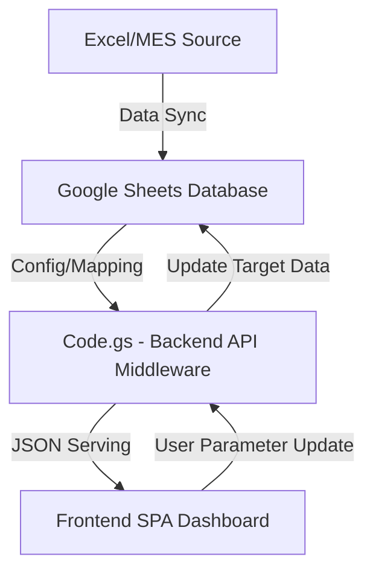

# 시스템 아키텍처 (Generic PMS Boilerplate)

본 프로젝트는 구글 워크스페이스를 Database(Google Sheets) 겸 API 레이어(Apps Script)로 활용하는 범용 공정/품질 관리 시스템(PMS) 구조론을 정의합니다.

## 1. 시스템 구성도

## 2. 핵심 모듈별 역할

### 2.1 Backend Layer (API Middleware)
`Code.gs`는 **무상태(Stateless) 동적 파싱 엔진**으로 작동합니다.
- 특정 비즈니스 데이터의 형태를 코드 자체에 강제하지 않습니다. 
- `PropertiesService`를 호출하여 클라우드 환경 변수(`SHEET_ID`, `COLUMN_MAPPING`)를 조회함으로써 런타임에 동적으로 타겟 시트와 동기화됩니다.

### 2.2 Frontend Layer (SPA Dashboard)
단일 페이지 웹 어플리케이션 방식으로, 백엔드가 반환한 JSON을 Chart.js 등을 이용해 렌더링합니다.
- **KPI Summary**: 일/주/월/연 단위 지표 트래킹.
- **Trend Analysis**: 동적 데이터 차트 렌더링.
- **Simulation**: 라인 밸런싱 모의 연산 후 클라우드에 영구 파라미터 적용(POST API).

## 3. Data Schema & Mapping 전략
과거 특정 도메인(Samjin)에 하드코딩 되어 있던 파서 스키마는 이제 외부 설정에 의존합니다.
* 환경변수에 `COLUMN_MAPPING` JSON 객체가 주어지면, 해당 문자열 기반으로 데이터를 서치합니다.
* 예: `{"seong": "프레스1라인"}` 설정 시 백엔드는 "프레스1라인" 컬럼 데이터를 파싱하여 프론트엔드에게 `seong` 키값으로 전달하므로, 프론트엔드의 화면 렌더링은 어떠한 중단 없이 호환됩니다.
