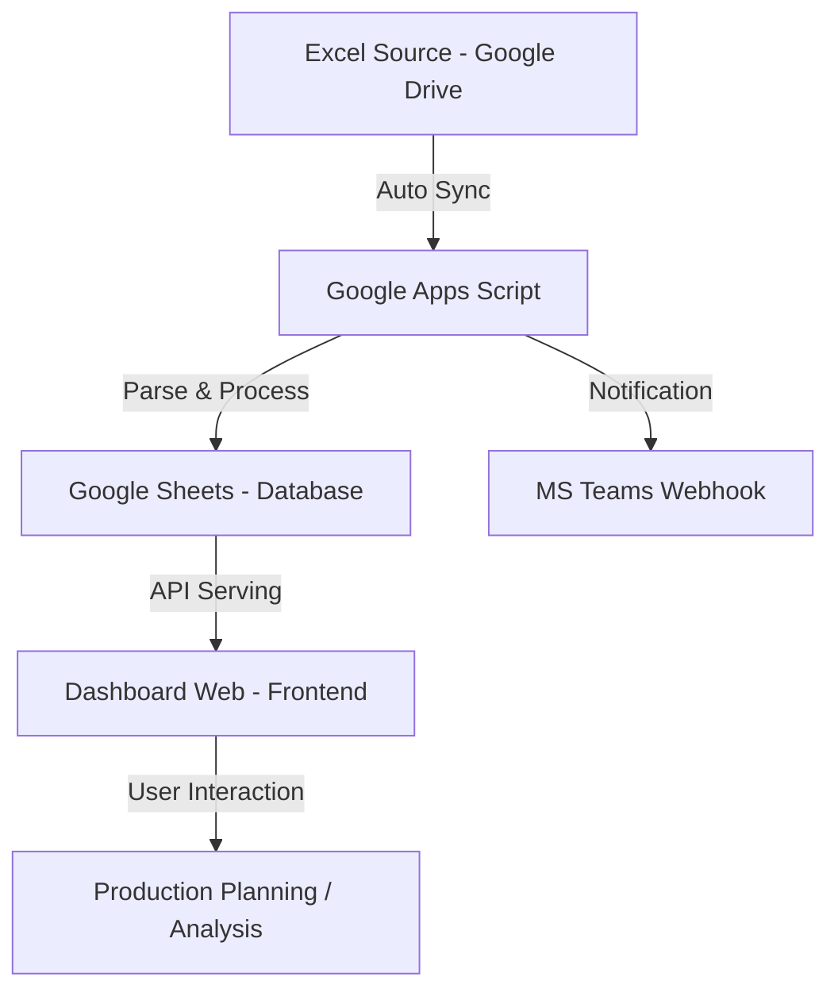

# 시스템 아키텍처 및 웹 구조 정의서

삼진 Gasket 품질 업무 자동화 시스템(QMS)의 전체 구조와 데이터 흐름을 정의합니다.

## 1. 시스템 구성도

## 2. 웹 메뉴 구조 (Sitemap)
대시보드는 Single Page Application (SPA) 구조로 설계되어 있으며, 상단 네비게이션을 통해 각 메뉴로 이동합니다.

### 2.1 대시보드 (Dashboard)
- **KPI Summary**: 일/주/월/연 단위 주요 지표 (PPM, 달성률, 불량률)
- **Trend Analysis**: 시간 흐름에 따른 PPM 및 불량 추이 그래프
- **Issue Feed**: 특이사항(비고) 및 이상치 감지 내역 리스트

### 2.2 실시간 데이터 (Raw Data)
- **생산 현황**: 공정별(성형, 조립, 릴, 최종) 생산량 및 불량 상세
- **설비별 데이터**: 각 라인/호기별 가동 현황
- **Cap 탈거력**: 10개 샘플에 대한 측정 데이터 및 통계(Min/Max/Avg)

### 2.3 생산 계획 (Planning)
- **CAPA 설정**: 장비별 일일 생산 능력(Capa) 관리
- **가동률 시뮬레이션**: 가동 일수 및 투입 인원 변경에 따른 예상 생산량 계산
- **연간 로드맵**: 월별 생산## 3. Data Schema (Core)

### 3.1 Raw Data & Daily Sheet Mapping
| Category | Fields (Columns) | Logic |
| :--- | :--- | :--- |
| **생산현황 (Total)** | `seong`, `jorip`, `reel`, `final` | 공정별 총 생산량 |
| **성형 (Machine)** | `s5` ~ `s9` | 5개 호기 개별 생산량 |
| **조립 (Machine)** | `j1` ~ `j12` | 12개 호기 개별 생산량 (4호기 제외) |
| **포장/최종 (Machine)** | `r1`~`r4`, `f1`~`f3` | 릴 포장 및 최종검사기 개별 생산량 |
| **불량률 (6종)** | `sq`, `sc`, `co`, `sp`, `ti`, `et` | 찌그러짐, 스크레치, 오염, 스프링, 기울어짐, 기타 |
| **품질 지표** | `ppm`, `defect` | (불량수 / 최종검사량) * 1,000,000 |
| **Cap 탈거력** | `cap1` ~ `cap12` | 10~12개 샘플 개별 측정값 및 Min/Max/Avg |

### 3.2 Thresholds (관리 기준치)
대시보드 및 알림의 색인 기준입니다. (설정 메뉴에서 수정 가능)
1. **PPM 수준**: 500 이상 시 경고 (Red)
2. **월 목표 생산량**: 4,500,000 이하 시 주의 (Amber)
3. **불량유형별 한계치**: 단일 항목 80건 이상 시 경고 (Red)
4. **Cap 탈거력**: 410 이하 시 위험 (Red)

## 4. System Pipeline (Bidirectional)

1. **Auto Ingest**: 매일 07시 트리거가 원본 `raw data`를 분석하여 `daily/weekly/monthly` 탭 업데이트.
2. **Web API (doGet)**: 대시보드 요청 시 분석 데이터 및 `plan` 데이터를 JSON으로 송출.
3. **Web Sync (doPost)**: 대시보드에서 수정된 `plan` 수치 및 `threshold` 설정을 구글 시트에 즉시 저장.
tend Dashboards
